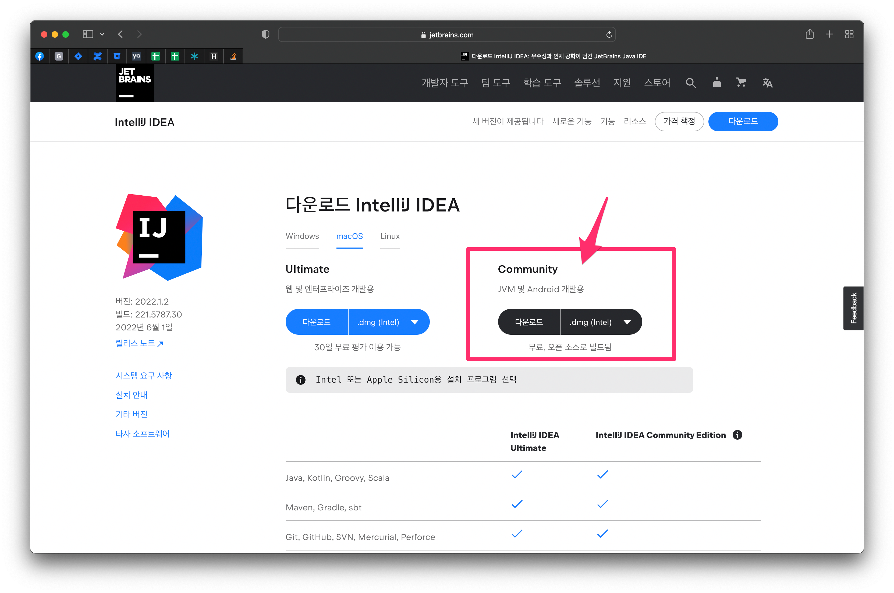
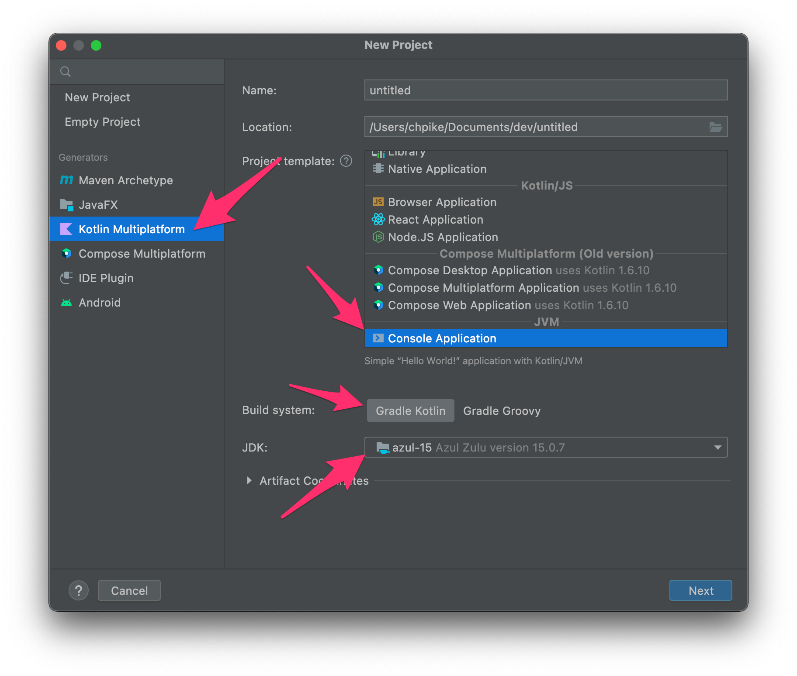

!주의: BlockQuote는 개인적인 감상을 적은 것입니다.

# 1강 Hello World - [link](https://www.youtube.com/watch?v=1OzBh2Uuj2s)
## 간단한 개발 구축 설명
- Kotlin은 JetBrain사에서 만든 언어이므로 JetBrain사의 IDE를 사용한다. 무료버전인 [IntelliJ IDEA CE](https://www.jetbrains.com/ko-kr/idea/download/#section=mac)를 받아 설치하자.

- IntelliJ IDEA CE 설치하고 new project를 만들때 다음에 유의하자.

  - Kotlin Multiplatform 을 선택한다.
  - Kotlin만 공부하겠다 하면 Console Application을 선택한다.
  - Build system은 Gradle Kotlin을 선택한다.
  - JDK는 **22년 06월 기준**, Android를 같이하겠다면 15, Kotlin만 공부하겠다면 17로 설정한다.
  > 어차피 Kotlin만 공부한다면, Console Appliication 만으로 충분할 듯. Build System은 추후 안드로이드 개발 등을 생각해보면 구글 검색 시 가장 많이 노출되는 Gradle을 선택하는게 이러울 것 같다.
## Kotlin 이해
- 현재 시점에서 Kotlin 전용 가상머신이 존재하지 않는다. (JetBrain사 인터뷰에서 계획은 있다함)
    - Kotlin 바이트코드가 Kotlin 컴파일러에 의해 만들어지면, 이를 이용해 원하는 플랫폼으로 다시 한번 번역이 됨.
    - 플랫폼 위에 개별로 존재. 플랫폼을 고려하지는 않음. 단순 번역.
        - JVM : 가장 완벽한 번역 및 최대한 관련 기능 제공.
        - JS : 컴파일이 느리지만 리플렉션을 제외하면 대부분의 기능 제공.
        - Android : 구글과 협력하여 꽤 높은 기능을 제공.
        - iOS : Kotlin이 자체적으로 iOS용 GC를 생성하여 메모리 관리.
        - 네이티브(linux/mac os 등 OS 타겟) 및 웹어셈블리 : 역시 GC를 만듬 (심지어 웹 어셈블리를 표준으로 제안 중)
        > iOS에서 GC가 동작한다면, 꽤나 프로그래밍이 힘들 것 같다. 개발을 하면서 해당 모듈이 메모리에서 바로 소거될 것을 간주하고 개발하는 경우가 있기 때문에, 따로 GC가 동작하면 혼란스러움이 생기지 않을까?
- Jetbrain IDE로 부터 수집된 무기명 소스코드로 패턴을 분석, 보다 생산성이 높은 추상화된 개념을 제공
- UI 영역이 배제되어있는 순수 메모리와 연산 분야에서의 플랫폼 추상화를 지향.
   - UI가 없기 때문에 개발팀의 부하를 줄이기 위해 iOS, Android 프로젝트를 하나로 묶겠다는 시도를 하면, 공통모듈 팀, UI팀으로 나뉘게 됨. 오히려 코드량이 늘어난다.
   - 구글과 협작하여 Compose라는 UI Layer를 만듬. 현재는 Android만 반영.
- 그러므로 Kotlin을 배울 땐 다른 언어의 무엇으로 바라보지 말것. Kotlin만의 언어 구성과 철학을 익혀야 함.
## Kotlin의 기본형(Basic Type)
- 원시형의 개념을 제거하고, 기본형을 정의.
- 번역 대상이 되는 플랫폼에 유리한 형태로 알아서 번역됨.
- Kotlin의 관심사는 **불변성을 갖는 형**인지 아닌지이다.
- 단, 제네릭 배열과 원시형 배열(java에서 [int]와 같은)을 분리 / 호환시키기 위한 원시형 배열을 별도 제공.
> swift도 그러하지만 불변에 집착하는 것은 최신 언어들의 특징인 것 같다.
## Kotlin의 내장형(Built-In Type)
- Any: 모든 형의 부모.
- Nothing: 모든 형의 자식이자 제어흐름의 종결을 형으로 표현.
    - upper bound : 모든 형의 부모.
    - lower bound : 모든 형의 자식.(대부분의 언어가 없다.)
    - Nothing은 lower bound. OOP의 대체 가능성을 무조건 따를 수 있다.
    > 예외 처리 제어를 너무 편하게 할 수 있다.
- Unit: 없음을 나타내는 형이자 **싱글톤 객체**
    - procedure: 특정한 로직을 처리하기만 하고 결과 값을 반환하지 않는 서브 프로그램
    - procedure와 function의 차이가 발생함. procedure를 없애기로 맘먹은 Kotlin은 Unit을 반환
    - JS에서 function에 return 문을 작성하지 않으면 자동으로 `return undefined` 와 동일 시 되는 것과 같이 Kotlin에서 return을 작성하지 않으면 Unit이 반환됨.
- Throwable: 모든 예외의 부모
- Funcion: 함수를 나타내는 형
    - java의 람다를 함수라 생각하면 안됨. java의 람다는 interface의 익명 객체임.
    - Kotlin 언어 차원에서는 함수형이라는 것이 존재한다.
- KClass, KCallable, KProperty, KFunction, KType: 리플레션 타입
    - Kotlin은 self description이 되는 언어. reflection의 도움없이 처음부터 언어가 언어를 구성하는 요소를 객체화함.
    - reflection은 코드를 parsing 하면, [Abstract Syntax Tree (AST)](https://www.geeksforgeeks.org/abstract-syntax-tree-ast-in-java/)가 생기고, runtime 객체로 잡히기 때문에 사용 가능함.
    - Kotlin은 2단계(Kotlin 컴파일 후 플랫폼 컴파일) 컴파일을 하기 때문에 그냥 사용할 수 있임. 심지어 순서를 지키지 않아도 됨.
    > 이건 java의 reflection으로 뭔가를 처리해보면 이게 얼마나 좋은지 알 수 있다. 내 지식의 한계일 수 도 있지만, swift에 Mirror를 통해 일부 기능을 지원하지만, 동일하게 구현하겠다면 Objective-C쪽 도움을 받아야 한다.

---
## Calculator
여기에서부터 일반적인 개발 내용으로 전개. 다양한 개발의 베이스 지식이 소개됨.
- 뭔가 다양한 조건이 생길 수 있는 경우라면, accept list(allow list, white list) 스타일로 개발할 것.
    - *이 방에는 누구누구는 못 들어와* 라는 스타일로 개발을 하면 안됨.
    - 이유 - 그 누구누구가 늘어나기 때문에 관리하기가 어렵다.
    - 효과 - accept list를 사용하면 로직이 짧아진다. 예외가 발생하지 않는다. 처음부터 정한 list 일 때만 로직이 작동함을 보장하기 때문.
    - 반대어 - deny, black list
- val은 값(value), var는 변수(variable), const val은 상수(constant)
- 형 지정시, 변수 식별자(identifier) 뒤에 :과 함께 작성한다
    - 이유 - 형 지정이 타입추론으로 작성하지 않아도 되는 옵셔널이기 때문. (java 처럼 앞에 형이 있다면 생략이 될 수 없을 것이다.)
- Kotlin의 형추정 방식
    - max upper bound: 이리저리 형추정을 해보았는데 모호하면 최상위 형으로 추정. 즉, Any가 되어 버린다.
    - 기본이 max upper bound로 가버리기 때문에 모호해질 것 같으면 형을 지정할 것.
- 형 추론은 머신 파워를 이용하기 때문에, 모두 형 지정을 하면 컴파일이 빨라진다.
- 리터럴이란?
    - 더 이상 분해할 수 없는 값의 표현. 그 언어에서 어떤 값을 표현할 때, 이 표현말고는 표현할 방법이 없는 것.
    - 예 : 정수 123을 표현할 경우, `123` 말고 다른 표현방법이 존재하는가?
- 함수
    ```Kotlin
    fun 함수명(인자): 반환형 {
        몸체
        return 반환값
    }
    ```
- 함수식
    ```Kotlin
    fun 함수명(인자): 반환형 = 반환식
    ```
- 정규식 설명
    - 3연산으로 동작
        - 접합: 정규식이란 원래 문자 하나를 얻는 것이다. ab와 같이 2개를 얻을 수 있게 하는 것을 접합이라 부름.
        - 선택: |를 활용하여 좌 또는 우를 선택
        - 반복: *을 활용해 여러개가 있는 것을 한꺼번에 인식하는 것.
    - `[...]`(character class) : 대괄호에 등장하는 문자 중 하나.
    - `[^...]`(exception charater class): 대괄호에 등장하는 문자가 아닌 것.
    - `\d`: 0, 1, 2, 3, 4, 5, 6, 7, 8, 9
    - `(...)` (capture group): 정규식의 match 결과, 하나의 값으로 얻어낼 수 있는 묶음. 고차방정식 풀이에 자주 사용하는 치환으로 생각하면 편하다.
    - `(?:...)` (non-capture group): group화는 하지만, 값이 얻어지지는 않는다.
    - `(..|..)` (alternative): 선택.
    - `?` (zero or one): 없거나 하나가 있음을 의미하는 수량자
    - `+` (one or unlimited): 하나 이상이 있음을 의미하는 수량자
- when
    ```Kotlin
    when(대상) {
        값1 ->
        값2 -> {...}
        ...
        else ->
    }
    val v: T = when(대상) {
        값1 -> T
        값2 -> { 
            ...
            T
        }
        ...
        else -> T
    }
    ```
    - 자바의 switch에 있는 fall through가 when에서는 동작되지 않는다.
    - when을 이용한 값 할당의 경우, Throwable를 반환해도 정상적으로 인식한다. 즉, 절대 나올수 없는 케이스로 보장할 수 있다면 `편안하게 Throwable return 값으로 사용할 수 있다.`
---
[< 목차로 가기](../README.md)
